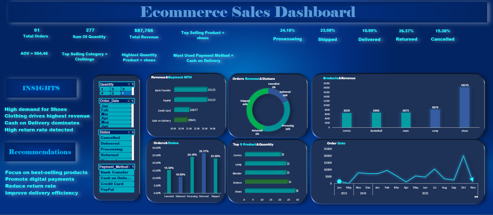

# Ecommerce Sales Dashboard

An interactive Excel dashboard designed to analyze e-commerce sales performance, products, orders, revenue, payment methods, and order status.

## 📊 Dashboard Preview

## 📌 Project Overview

This project presents an interactive e-commerce sales dashboard built using Microsoft Excel.

The dashboard provides a clear overview of sales performance and helps identify trends across products, categories, payment methods, order statuses, and order dates.

## 🎯 Business Objectives

The dashboard was developed to:

- Monitor overall sales revenue and order performance.
- Analyze total orders and quantities.
- Identify top-selling products and categories.
- Analyze revenue distribution by payment method.
- Track order status and fulfillment performance.
- Identify sales trends over time.
- Generate actionable business insights from sales data.

## 📈 Key KPIs

- **Total Orders:** 91
- **Total Quantity:** 277
- **Total Revenue:** $87,766
- **Average Order Value (AOV):** $964.46
- **Top Selling Product:** Shoes
- **Top Selling Category:** Clothing
- **Most Used Payment Method:** Cash on Delivery

## 💡 Key Insights

- Shoes have the highest sales quantity among the products.
- Clothing is the top-selling category.
- Cash on Delivery is the most frequently used payment method.
- The dashboard highlights differences in order status, including processing, shipped, delivered, returned, and cancelled orders.
- Sales performance varies over time and can be monitored through the order-date trend.

## 🛠️ Tools & Technologies

- **Microsoft Excel**
- **PivotTables**
- **Excel Charts**
- **Data Analysis**
- **Data Visualization**
- **Interactive Dashboard**
- **KPI Reporting**

## 📁 Project Files

- `E-Commerce Sales data.xlsx` — Source data used for the analysis.
- `dashboard-preview.png` — Dashboard preview.

## 👤 Author

**Yousif Essam**

Data Analyst | Power BI | SQL | Python | Excel
